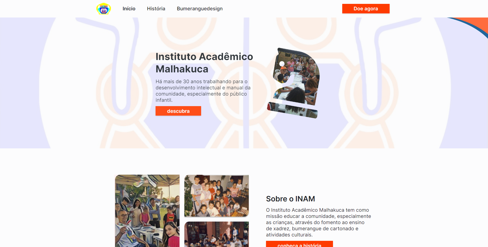
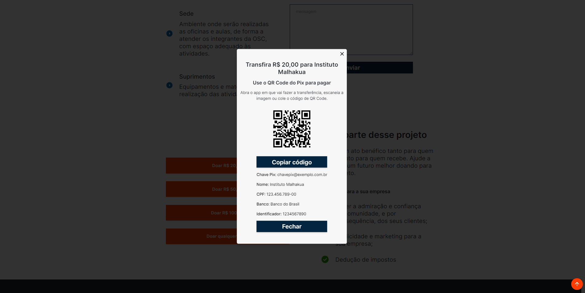
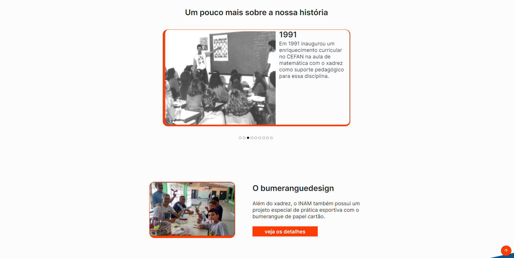
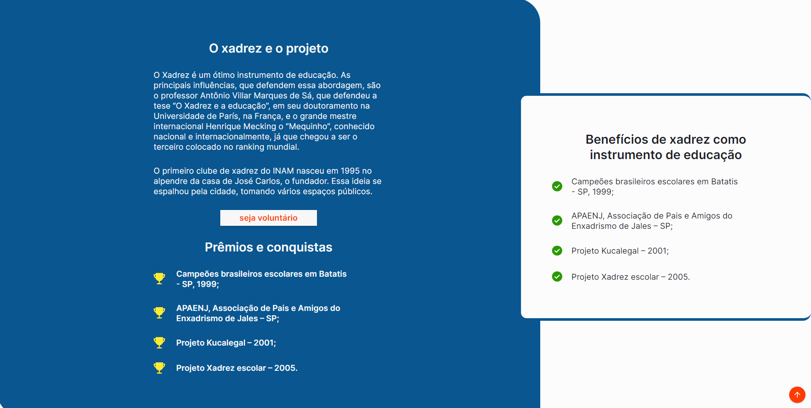
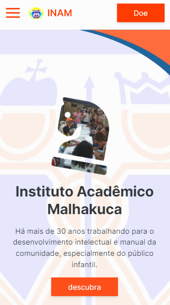
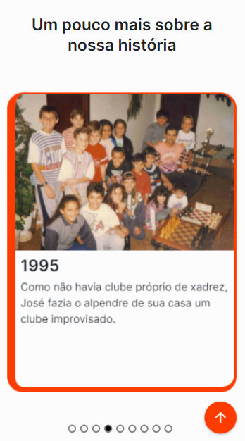
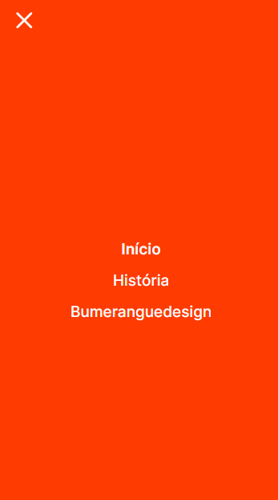

  
  
  
  
  
  
  
  
  

# 💻 Website Malhakuca

O site em questão é um projeto beneficente que visa ajudar o Instituto Acadêmico Malhakuca a arrecadar fundos para educar a comunidade, em especial as crianças, por meio do ensino de xadrez, bumerangue de cartonado e atividades culturais. As tecnologias utilizadas no desenvolvimento do site foram Next, TypeScript, Tailwind, React-Feather e React-Multi-Carousel.

## 🚀 Tecnologias

- [Next.js](https://nextjs.org/)
- [TypeScript](https://www.typescriptlang.org/)
- [TailwindCSS](https://tailwindcss.com/)
- [ReactFeather](https://github.com/feathericons/react-feather)
- [ReactMultiCarousel](https://github.com/YIZHUANG/react-multi-carousel)
- [Nodemailer](https://nodemailer.com/about/)
- [ReactHookForm](https://react-hook-form.com/)
- [ReactToastify](https://fkhadra.github.io/react-toastify/introduction/)
- [Zod](https://github.com/colinhacks/zod)

## 📑 Features

- Apresentação da história da fundação do Instituto Acadêmico Malhakuca e do fundador;
- Exibição dos projetos e atividades educacionais oferecidos pelo Instituto;
- Possibilidade de doação financeira para apoiar o trabalho do Instituto;
- Formulário de contato para envio de mensagens ao Instituto, com envio de email utilizando a biblioteca Nodemailer;
- Compartilhamento fácil do site e de suas informações em redes sociais.

## 🖼️ Previews

### Web

| Home Malhakuca                            | Modal Donate                               |
| ----------------------------------------- | ------------------------------------------ |
|  |  |

| Slide                                      | Chess Section                              |
| ------------------------------------------ | ------------------------------------------ |
|  |  |

### Mobile

| Home Malhakuca                           | Modal Donate                              |
| ---------------------------------------- | ----------------------------------------- |
|  |  |

| Slide                                     | Menu                                     |
| ----------------------------------------- | ---------------------------------------- |
|  |  |

## 🖼️ License

This project is licensed under the MIT license.

Made with ♥ by Wallysson Lima.
